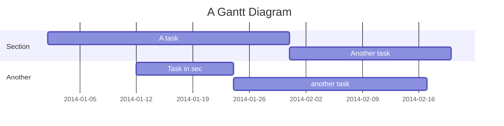
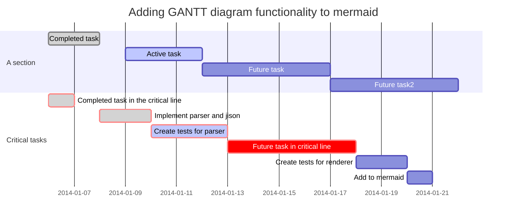

# Developements documentation

Generiert mit der Hilfe **mdBook**
is a command line tool and Rust crate to create books using Markdown
files. It's very similar to Gitbook but written in
[Rust](http://www.rust-lang.org).

What you are reading serves as an example of the output of mdBook and at the
same time as a high-level documentation.

> **💡 Tip:** You can search through this book by clicking on the 🔍 icon at the
> top of the page, or by pressing the `s` key.

mdBook is free and open source, you can find the source code on
[GitHub](https://github.com/rust-lang-nursery/mdBook). Issues and feature
requests can be posted on the [GitHub issue tracker](https://github.com/rust-lang-nursery/mdBook/issues).

## Projekt-Informationstafel

* [Hardware binding]()
* [Analyzers library]()

## API docs

Alongside this book you can also read the [API docs](https://docs.rs/mdbook/*/mdbook/) generated by Rustdoc if you would like
to use mdBook as a crate or write a new renderer and need a more low-level
overview.

## Rust

[Rust](https://www.rust-lang.org/en-US/) is a systems programming language that runs blazingly fast, prevents segfaults, and guarantees thread safety.
[Rust Documentation](https://www.rust-lang.org/en-US/documentation.html)
Learn more - Rust interesting books and Projects.

- [Edition 2018](https://rust-lang-nursery.github.io/edition-guide/)
- [Cargo](https://doc.rust-lang.org/cargo/index.html) package manager.
- [Konfigurierungssystem basiert auf TOML](https://docs.rs/toml/0.4.8/toml/)
- [Cryptographic algorithms written in pure Rust](https://github.com/RustCrypto)
- [Operating System Development in Rust](https://github.com/rust-osdev)
- [Rust Embedded books](https://rust-embedded.github.io/bookshelf/)

## Extra

- [Wikisystem TiddiWiki5](https://github.com/Jermolene/TiddlyWiki5)

## Web Css Html

- [CSS cheatsheets](https://devhints.io/)h
